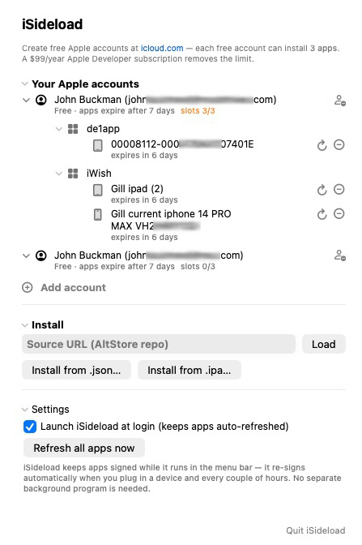

# iSideload

A small **macOS menu-bar app** that installs and keeps iOS apps signed on your
devices using a **free Apple ID** — a lean, self-contained alternative to
AltStore/SideStore that signs on the Mac.

> **New to sideloading?** Read the **[full step-by-step guide](docs/GUIDE.md)** —
> what to do on your iPhone/iPad, what to download, and the real benefits & limits.

## Download

**[⬇︎ iSideload 0.1 alpha (notarized `.dmg`)](https://github.com/johnbuckman/iSideload/releases/latest)** — macOS 14 (Sonoma) or newer, Apple Silicon.

Open the `.dmg` and drag **iSideload** to **Applications**. It's signed with a
Developer ID and notarized by Apple, so it opens normally — no right-click /
"Open Anyway" dance. iSideload runs in the **menu bar** (no Dock icon); click the
crate icon to open the panel. This is an **early alpha** — expect rough edges.

## Presentation

A slide overview of iSideload — current state, how USB install works, the
multi-Apple-ID and $99 paid-account benefits, the menu-bar UI, and the
work-in-progress Wi-Fi updating — is in [`docs/`](docs):

- **[iSideload.pdf](docs/iSideload.pdf)** — view in any browser
- **[iSideload.pptx](docs/iSideload.pptx)** — editable PowerPoint

## What it does

- **Sign in with one or more Apple IDs** (free or paid). Login, 2-factor
  (including SMS for accounts with no trusted device), and the Apple developer
  provisioning are all handled for you.
- **Install** an app from an AltStore-format **source URL**, a local **`.json`**
  catalog, or a single **`.ipa` / `.app`** file.
- Apps are signed with a **SHA-256 CodeDirectory via [zsign]** (the format iOS
  16–26 accept) using Apple's `codesign`-equivalent path, then installed over the
  lockdown/`usbmux` protocol.
- **Keeps apps alive** with no separate background program: iSideload re-signs and
  reinstalls before the 7-day free-provisioning expiry — on a timer, the moment you
  plug a device in, and (near expiry) by re-checking **every 5 minutes** and pushing
  as soon as the device is reachable over USB or Wi-Fi. It **launches at login by
  default** so this happens unattended.
- **Manage everything from the menu bar**: multiple accounts (each free ID gives
  3 app slots, shown as a live `slots N/3`), grouped by account → app → device with
  collapsible sections and a panel that **auto-sizes to its contents**. Each device
  row has a circular-arrow **Refresh** (re-sign + reinstall now) and a **–** that
  uninstalls the app and frees its slot.

Free Apple IDs (create one at <https://icloud.com>) can install **3 apps**; a
$99/year Apple Developer subscription removes that limit and extends signing to
one year.

## Build

```
swift build --product InstallerApp     # the menu-bar app
swift build --product Provision         # the CLI (install / refresh)
```

`./bundle-app.sh` builds and bundles the menu-bar app into `iSideload.app`. The
device tools (a small [libimobiledevice](https://github.com/libimobiledevice/libimobiledevice)
helper in [`Helpers/idevice`](Helpers)) are bundled in the app, so it's
**self-contained** — no Python or external tools required at runtime.

## Credits & license

Built on **[AltSign]** from the **[AltStore]** / **[SideStore]** projects
(© Riley Testut and contributors), which are licensed **AGPL-3.0**. Because this
is a derivative work, iSideload is likewise licensed under the **GNU Affero
General Public License v3.0** — see [`LICENSE`](LICENSE).

The signer is **[zsign]** by zhlynn, included under the **MIT License**
(see [`Dependencies/zsign`](Dependencies/zsign)).



[AltSign]: https://github.com/SideStore/AltSign
[AltStore]: https://github.com/altstoreio/AltStore
[SideStore]: https://github.com/SideStore/SideStore
[zsign]: https://github.com/zhlynn/zsign
